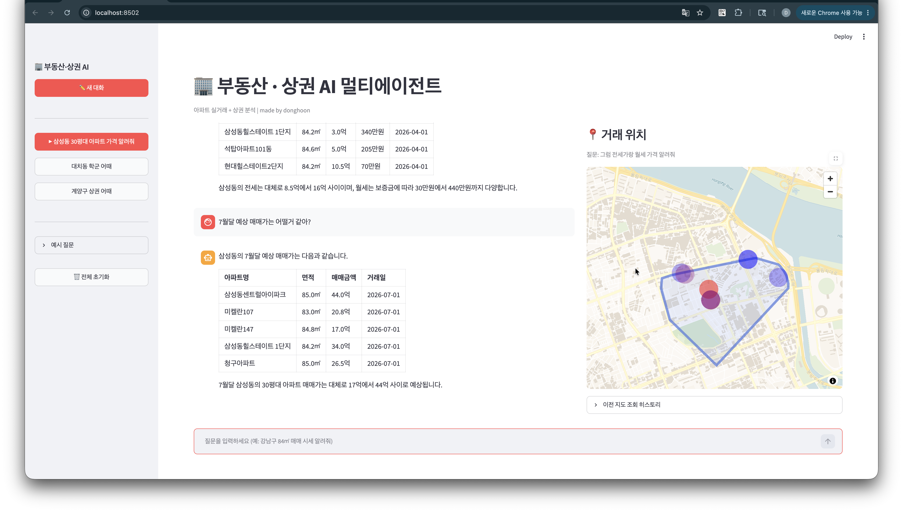

# 부동산·상권 멀티에이전트 AI

> "역삼동 84㎡ 전세 시세 알려줘", "강남구 이상거래 탐지해줘", "상계동 학군 어때?"  
> 자연어 한 문장으로 아파트 시세 조회·가격 예측·이상거래 탐지·지역 정보 검색이 가능한 AI 서비스입니다.


---

## 화면



---

## 개요

| 항목 | 내용 |
|------|------|
| 에이전트 프레임워크 | AutoGen 0.4 Swarm + Handoff (`autogen-agentchat==0.4.9.3`) |
| LLM | GPT-4o-mini |
| 가격 예측 모델 | LightGBM (수도권 실거래 1,129,994건 학습, R² 0.88) |
| Vector RAG | ChromaDB + BM25 (Kiwi 형태소분석) → RRF 병합 → FlashRank 재정렬 |
| DB | PostgreSQL 17 (Docker) |
| 모니터링 | Langfuse (에이전트별 실행 흐름 추적) |
| 프론트엔드 | Next.js 15 (App Router) + Kakao Maps API · **Vercel 배포** |
| 백엔드 배포 | AWS EC2 (Docker Compose) + Vercel API route proxy |
| 평균 응답 시간 | **7.30초** (GEval 0.904 / 라우팅 100%) |

---

## 왜 만들었나

네이버 부동산·직방은 데이터는 풍부하지만 필터 설정 → 지역 선택 → 목록 탐색을 직접 거쳐야 합니다.  
ChatGPT는 자연어로 질문할 수 있지만 실거래 데이터가 없습니다.

이 프로젝트는 **실거래 데이터 기반 응답 + 자연어 인터페이스**를 동시에 제공합니다.  
또한 직거래·이상거래를 탐지해 시세 왜곡 없이 신뢰할 수 있는 데이터를 사용합니다.

---

## 왜 AutoGen 0.4 Swarm인가

LangGraph도 검토했으나, AutoGen Swarm을 선택한 이유는 **Handoff 패턴**이 이 문제에 더 적합했기 때문입니다.

| 비교 항목 | LangGraph | AutoGen 0.4 Swarm |
|-----------|-----------|-------------------|
| 라우팅 방식 | 그래프 엣지로 사전 정의 | 에이전트가 런타임에 Handoff 결정 |
| 복합 질문 처리 | 복수 경로를 그래프에 미리 설계해야 함 | 에이전트가 판단해 다음 에이전트로 위임 |
| 새 에이전트 추가 | 그래프 엣지 재설계 필요 | participants 목록에 추가만 하면 됨 |
| 프로덕션 레퍼런스 | 많음 (주류) | 적음 (신규) |

**선택 근거**: "강남구 이상거래 탐지하고 학군도 알려줘"처럼 여러 에이전트가 협력해야 하는 복합 질문에서는, 그래프 엣지로 모든 경우의 수를 미리 정의하는 방식보다 Handoff 패턴이 더 유연하게 동작합니다. 프로덕션 레퍼런스가 적다는 단점은 인지하고 있으며, API 변경에 대비해 `autogen-agentchat==0.4.9.3` 버전을 고정해 사용합니다.

---

## 에이전트 구조

질문이 들어오면 하이브리드 라우터가 유형을 분류하고, 담당 에이전트가 직접 최종 답변을 작성합니다. (ReportAgent 제거 — 응답 속도 30% 향상)

```
┌─────────────────────────────────────────────────────────┐
│                     사용자 질문                            │
└───────────────────────────┬─────────────────────────────┘
                            │
                            ▼
┌─────────────────────────────────────────────────────────┐
│           OrchestratorAgent (하이브리드 라우터)              
│                                                          
│  1. 명시적 offscope 키워드 → 즉시 거부 (LLM 미호출)            
│  2. 도메인 키워드 매칭 → fast path Handoff                  
│  3. 키워드 미매칭 → GPT-4o-mini fallback으로 의도 분류         
└──┬──────────┬──────────┬──────────┬──────────┬──────────┘
   │          │          │          │          │
   ▼          ▼          ▼          ▼          ▼
DataQuery  Prediction   RAG      Anomaly   즉시 거부
  Agent      Agent     Agent      Agent    (LLM 없음)
   │          │          │          │          │
   │  답변 + [[TERMINATE]] 직접 작성    │          │
   └──────────┴──────────┴──────────┘          │
                     │                         │
                     ▼                         ▼
        Next.js UI (Vercel)              "서비스 범위 외"
      (채팅 + Kakao Maps 지도)             0.2s 응답
```

### 에이전트별 역할

| 에이전트 | LLM | 담당 도구 | 처리 질문 예시 |
|----------|-----|-----------|----------------|
| **OrchestratorAgent** | △ fallback 시만 | — | 모든 질문의 첫 관문 |
| **DataQueryAgent** | GPT-4o-mini | `query_trade_data` `query_rent_data` `query_trade_nearby` `query_rent_nearby` `query_commercial_data` `query_district_avg_price` | "역삼동 시세", "마포구 음식점" |
| **PredictionAgent** | GPT-4o-mini | `predict_price` `get_station_coordinates` | "강남구 84㎡ 가격 예측" |
| **RAGAgent** | GPT-4o-mini | `search_area_info` → fallback `search_web` (Tavily) | "상계동 학군", "GTX 개통 일정", "대치동 재건축" |
| **AnomalyAgent** | GPT-4o-mini | `detect_anomaly` `query_direct_trade_ratio` | "강남구 이상거래 탐지" |

---

## 사용 데이터

### 부동산 실거래 (PostgreSQL)

국토교통부 실거래가 공공 API(data.go.kr)로 수집합니다.

| 테이블 | 규모 | 설명 |
|--------|------|------|
| `apt_trade` | 1,129,994건 (2020~2026) | 수도권 아파트 매매 실거래 |
| `apt_rent` | 수도권 전체 | 아파트 전세·월세 실거래 |
| `apt_geocode` | 14,273개 단지 | Kakao 지오코딩으로 확보한 단지 좌표 |

### 상권 (PostgreSQL)

소상공인시장진흥공단 상권정보 CSV를 파싱해 적재합니다.

| 테이블 | 설명 |
|--------|------|
| `commercial_store` | 개별 업소 (업종·좌표·개폐업일) |
| `commercial_area` | 동·업종별 집계 통계 |

### 교육·교통 (PostgreSQL)

교육부·서울교통공사·국토교통부 공공 CSV를 파싱해 적재합니다.

| 테이블 | 규모 | 출처 |
|--------|------|------|
| `school_info` | 12,074개교 (초·중·고) | 교육부 학교기본정보 |
| `academy_info` | 138,275개 | 교육부 학원교습소정보 |
| `subway_station` | 276개 역 (1~8호선) | 서울교통공사 역사 좌표 |
| `bus_stop` | 227,060개 | 국토교통부 전국 버스정류장 |

### Vector RAG 문서 (`rag/docs/`, 197개)

DB 데이터를 동 단위로 집계해 자동 생성한 `.txt` 문서입니다.  
각 문서는 한 동(洞)의 전체 현황을 담고 있으며, ChromaDB에 임베딩되어 벡터 검색에 활용됩니다.

```
# 상계동 부동산·상권 현황 보고서

## 아파트 매매 실거래 (2020년~)
- 총 거래 건수: 4,312건 / 평균 매매가: 5.5억원

## 전세·월세 현황 (2022년~)
- 전세 평균 보증금: 2.6억원

## 상권 현황
- 총 영업 중 점포: 2,841개

## 학군 현황
- 초등학교 42개, 중학교 26개, 고등학교 25개
- 입시·보습 학원 2,100개

## 교통 현황
- 인근 지하철역: 마들역(7호선, 429m), 노원역(4호선, 1,018m)
- 버스정류장: 134개 (1km 이내)
```

검색 흐름: 동명 직접 조회 → BM25 키워드 검색 + 벡터 유사도 검색 (각 15개 후보) → **RRF 병합** → **FlashRank 재정렬** (최종 3개 선택)

---

## 평가 결과

골든셋 **56건** 기준 자동 평가 (DeepEval GEval + 시스템 지표).  
케이스 구성: DataQueryAgent 29건 · RAGAgent 9건 · AnomalyAgent 7건 · PredictionAgent 6건 · OrchestratorAgent(범위 외) 5건.

```bash
# 평가 실행
python -m tests.eval.run_eval --mode full     # 전체 평가 (LLM-as-a-Judge, API 비용 발생)
python -m tests.eval.run_eval --mode routing  # 라우팅 정확도만 (빠름, 비용 없음)
pytest tests/eval/test_system_metrics.py      # 라우팅·latency (CI)
```

### 핵심 지표

| 지표 | 결과 | 설명 |
|------|------|------|
| **라우팅 정확도** | **100%** | 56건 전체 올바른 에이전트로 라우팅 |
| **GEval (LLM-as-Judge)** | **0.904 / 1.0** | 답변 관련성·완결성 종합 |
| **Faithfulness** | **0.936 / 1.0** | DB 데이터에 근거한 사실성 |
| **Answer Relevancy** | **0.865 / 1.0** | 질문 대비 답변 적합성 |
| **Map Points 정확도** | **91.1%** | 지도 마커 반환 여부 |
| **평균 응답 시간** | **7.30초** | ReportAgent 제거 후 30% 개선 (기존 10.25초) |
| **범위 외 거부 응답** | **0.2초** | LLM 없이 키워드 규칙만으로 즉시 거부 |

### 지표 개선 과정 (22건 → 56건)

| 지표 | 초기 (22건) | 최종 (56건) | 변화 |
|------|------------|------------|------|
| 라우팅 정확도 | 100% | **100%** | → |
| GEval | 0.893 | **0.904** | ↓ (56건 난이도 분산) |
| Faithfulness | 0.831 | **0.936** | ↑ +10.5pp |
| Answer Relevancy | 0.594 | **0.865** | ↑ +27.1pp |

### 성능 개선 상세

#### Answer Relevancy: 59.4% → 86.5% (+27.1pp)

**원인 분석 1 — [[TERMINATE]] 태그가 DeepEval에 전달**

에이전트 답변에는 Swarm 종료 신호인 `[[TERMINATE]]`가 마지막 줄에 포함됩니다. 이 태그가 제거되지 않은 채 DeepEval에 전달되면, AnswerRelevancyMetric이 `"[[TERMINATE]]"`를 하나의 문장으로 인식해 "질문과 무관한 문장"으로 판정하고 점수를 낮췄습니다.

```python
# tests/eval/run_eval.py — 수정
clean_answer = answer.replace("[[TERMINATE]]", "").strip()  # 추가
tc = make_deepeval_test_case(actual_output=clean_answer, ...)
```

**원인 분석 2 — offscope 거부 답변이 0점으로 평균 하락**

"오늘 날씨 어때?" 같은 범위 외 질문에 대한 거부 답변("저는 부동산 AI입니다...")은 질문과 의미적으로 무관하므로 AnswerRelevancyMetric이 0점을 줬고, 이 5건이 전체 평균을 끌어내렸습니다. 거부는 의도된 정상 동작이므로 측정 대상에서 제외했습니다.

```python
# offscope 케이스는 relevancy 측정 제외
if case.get("expected_agent") == "OFFSCOPE":
    return result  # LLM-as-a-Judge 건너뜀
```

**원인 분석 3 — PredictionAgent 단문 답변**

예측 에이전트가 `"약 28.21억원입니다."` 한 줄만 반환하면, 질문 의도(예: "오를까 내릴까")에 대한 해석 없이 수치만 던지는 꼴이 되어 relevancy가 0점 처리됐습니다. 예측값 + 시세 해석 + 유의사항의 3문장 구조를 프롬프트에 명시했습니다.

```
## 답변 작성 형식
1. 예측 결과: "[지역] [면적]㎡의 예측 매매가는 약 X.XX억원입니다."
2. 해석: 해당 가격이 지역 시세 대비 어느 수준인지 한 문장으로 설명
3. 유의사항: "LightGBM 모델 기반 예측값으로, 실제 거래가는 다를 수 있습니다."
```

---

#### Faithfulness: 83.1% → 93.6% (+10.5pp)

도입한 **집계 통계 고정**이 Faithfulness에도 긍정적으로 작용했습니다. LLM이 도구 반환값 기반으로만 답변하도록 제약하면서, 환각(hallucination)이 줄고 DB 데이터에 근거한 사실성이 높아졌습니다.

---

#### OOD(Out-of-Domain) 라우팅 개선

**원인 분석**

초기 라우터는 키워드 블랙리스트 방식으로, 도메인 키워드가 없으면 기본값인 DataQueryAgent로 보냈습니다. "비트코인 살까요?"처럼 부동산과 무관한 질문도 DataQueryAgent가 받아 처리하려다 실패하는 OOD 문제가 있었습니다.

**개선 방법 — 키워드 화이트리스트 + LLM fallback 하이브리드**

| 단계 | 조건 | 처리 | LLM 호출 |
|------|------|------|----------|
| ① | offscope 블랙리스트 키워드 감지 | 즉시 거부 | ✗ |
| ② | 도메인 화이트리스트 키워드 매칭 | 해당 에이전트로 Handoff | ✗ |
| ③ | 키워드 미매칭 | GPT-4o-mini로 의도 분류 후 라우팅 또는 거부 | ✓ |

③ 단계에서 LLM이 in-scope로 판단하면 적절한 에이전트로 Handoff하고, offscope로 판단하면 거부합니다. 기존 방식 대비 OOD 질문의 오라우팅을 방지하면서 키워드에 없는 표현도 처리할 수 있게 됐습니다.

---

#### 골든셋 확장 (22건 → 56건)

초기 22건은 정상 케이스 위주로 구성되어 있어 실제 서비스 품질을 대변하기 어려웠습니다. 56건으로 확장하며 취약 케이스를 강화했습니다.

| 추가 유형 | 목적 |
|-----------|------|
| 멀티턴 (2 → 6건) | 지시어("그중에서", "같은 지역") 처리 능력 측정 |
| 이상거래 (2 → 7건) | 직거래·데이터 부족 케이스 포함 |
| 예측 (3 → 6건) | 다양한 지역·면적 조합으로 모델 일반화 측정 |
| offscope (2 → 5건) | OOD 거부 동작 검증 |
| 상권·RAG (신규) | 장소명 기반 조회·지역 특성 질문 추가 |

### 잔여 실패 케이스 원인 분석

개선 후에도 answer_relevancy가 낮은 5건은 에이전트·평가 메트릭의 구조적 한계에 기인합니다.

| 케이스 | relevancy | 근본 원인 | 분류 |
|--------|-----------|----------|------|
| `trade-03` 강남역 근처 전세 | 0.17 | DeepEval이 한국어 테이블 답변을 "관련 없는 문장 다수"로 파싱 | 평가 메트릭 편향 |
| `commercial-05` 홍대 주점 개수 | 0.17 | "몇 개야" 단답 질문에 개별 목록 테이블 포함 → 부가 정보를 노이즈로 판정 | 평가 메트릭 편향 |
| `rag-01` 마포구 유사 지역 | 0.17 | 번호 목록 형식 + retrieval context 없음 → AnswerRelevancyMetric 저평가 | 평가 메트릭 편향 |
| `anomaly-04` 잠실동 이상거래 | 0.20 | 잠실동 DB 수집 데이터 0건 → "분석 불가" 답변이 질문과 무관으로 판정 | DB 커버리지 한계 |
| `commercial-06` 강남역 근처 카페 | 0.38 | 장소명(역) 기반 상권 근접 검색 미지원 → 구 단위 전체 데이터로 대체 응답 | 도구 기능 한계 |

GEval(사람 기준 종합 평가) 기준으로는 같은 케이스들이 모두 **0.87~1.0**으로 정상 범위입니다.  
즉 실제 답변 품질은 양호하지만, AnswerRelevancyMetric이 한국어 테이블·목록 형식에 편향된 저평가를 보이는 메트릭 특성이 주된 원인입니다.

---

## 설치 및 실행

### 사전 요구사항

- Python 3.11+
- Docker Desktop (PostgreSQL 실행용)
- API 키: OpenAI, Kakao
- Langfuse 계정 (선택, 모니터링)

### 1. 환경 설정

```bash
git clone https://github.com/lh922j/multi-agent.git
cd multi-agent

cp .env.example .env
# .env 파일에 API 키 입력

python -m venv .venv
source .venv/bin/activate   # Windows: .venv\Scripts\activate
pip install -r requirements.txt
```

### 2. PostgreSQL 실행

```bash
docker compose up -d
# pgAdmin: http://localhost:5050
```

### 3. 데이터 적재

```bash
# 기존 실거래 SQLite → PostgreSQL (realestate/ 프로젝트 필요)
python scripts/migrate_db.py

# CSV 파일을 data/ 폴더에 배치 후 임포트
python scripts/import_education_csv.py   # 학교·학원
python scripts/import_transport_csv.py  # 지하철·버스
python scripts/import_commercial_csv.py # 상권
```

### 4. Vector RAG 구축

```bash
# DB → 동별 .txt 문서 생성
python scripts/build_commercial_docs.py       # 상권 문서
python scripts/collect_school_district.py     # 학군 문서
python scripts/collect_redevelopment.py       # 재개발·재건축 문서

# ChromaDB 임베딩
python scripts/build_vector_index.py
```

### 5. 앱 실행

```bash
# Next.js 프론트엔드 (로컬)
cd frontend && npm install && npm run dev
```

### 6. 평가

```bash
python -m tests.eval.run_eval --mode full     # 골든셋 56건 전체 평가 (API 비용 발생)
python -m tests.eval.run_eval --mode routing  # 라우팅 정확도만 빠르게 측정
```

---

## 디렉토리 구조

```
multi-agent/
├── frontend/                     # Next.js 15 프론트엔드 (Vercel 배포)
│   ├── app/                      # App Router (layout.tsx, page.tsx)
│   ├── components/               # ChatPanel, MapPanel, Sidebar
│   ├── hooks/                    # 커스텀 훅
│   ├── public/                   # 정적 자산 (GeoJSON 등)
│   ├── types/                    # TypeScript 타입
│   ├── next.config.mjs
│   ├── package.json
│   └── vercel.json
├── docs/
│   └── architecture.png          # 아키텍처 다이어그램
├── rag/
│   └── docs/                     # 동별 RAG 문서 197개 (.txt)
├── scripts/
│   ├── build_commercial_docs.py  # 상권 DB → 동별 RAG 문서 생성
│   ├── build_vector_index.py     # ChromaDB 임베딩·인덱싱
│   ├── collect_redevelopment.py  # 재개발·재건축 CSV → RAG 문서 생성
│   ├── collect_school_district.py # 학교·학원 데이터 → 학군 RAG 문서 생성
│   ├── import_commercial_csv.py  # 상권 CSV → PostgreSQL
│   ├── import_education_csv.py   # 학교·학원 CSV → PostgreSQL
│   ├── import_transport_csv.py   # 지하철·버스 CSV → PostgreSQL
│   └── migrate_db.py             # SQLite → PostgreSQL 마이그레이션
├── src/multi_agent/
│   ├── agents/                   # 5개 에이전트 정의
│   │   ├── router.py             # OrchestratorAgent (규칙 기반)
│   │   ├── data_query.py
│   │   ├── prediction.py
│   │   ├── rag_agent.py
│   │   └── anomaly.py
│   ├── tools/                    # 에이전트 도구 함수
│   ├── db/                       # SQLAlchemy 모델 + DB 엔진
│   ├── team.py                   # Swarm 조립 + stream_chat()
│   ├── api/main.py               # FastAPI 엔드포인트
│   └── config.py                 # 환경변수 관리
├── tests/
├── docker-compose.yml
├── pyproject.toml
└── .env.example
```

---

## 배포

### 라이브 서비스

| 서비스 | URL |
|--------|-----|
| **Next.js (프론트엔드)** | https://multi-agent-b9xv.vercel.app |
| **FastAPI** | http://98.84.101.118:8000/docs |

### 인프라

- **프론트엔드**: Next.js 15 (App Router) → **Vercel** (https://multi-agent-b9xv.vercel.app)
- **백엔드**: FastAPI + PostgreSQL 17 → AWS EC2 t3.small (Ubuntu 22.04) Docker Compose
- **HTTPS 연결**: Vercel API route proxy (Next.js → EC2 서버사이드 프록시)

```
multi_agent_fastapi    — FastAPI 백엔드      :8000
multi_agent_postgres   — PostgreSQL 17       :5432 (내부)
```

### EC2 배포 절차

```bash
# 1. 파일 전송 (로컬 → EC2)
scp -i <PEM_KEY> \
  src/multi_agent/db/models.py \
  src/multi_agent/rag/district_codes.json \
  ubuntu@98.84.101.118:~/multi-agent/

# 2. 컨테이너에 반영
docker cp ~/multi-agent/models.py           multi_agent_fastapi:/app/src/multi_agent/db/models.py
docker cp ~/multi-agent/district_codes.json multi_agent_fastapi:/app/src/multi_agent/rag/district_codes.json

# 3. DB 마이그레이션 (테이블 변경 시)
docker compose exec -T fastapi python -c \
  "from src.multi_agent.db.database import init_db; init_db()"

# 4. 재시작
docker compose restart fastapi
```

---

## 관련 프로젝트

- [realestate](https://github.com/lh922j/realestate) — 국토교통부 API 수집 + LightGBM 가격 예측 모델 학습 파이프라인
- [realestate_agent](https://github.com/lh922j/realestate_agent) — LangGraph 기반 단일 에이전트 버전 (이 프로젝트의 이전 버전)
